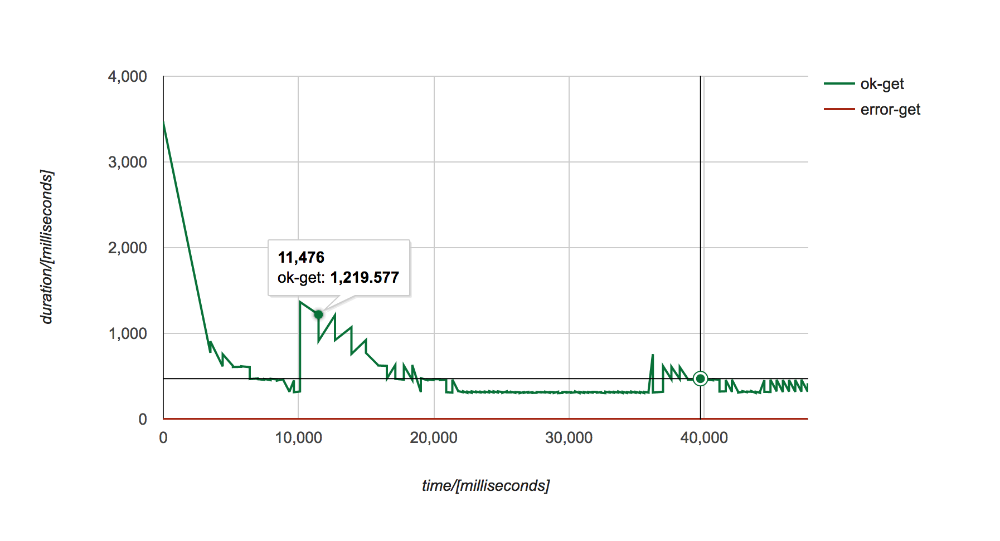

Blitzy - A not so simple HTTP load tester in Elixir
============================================


Inspired by this [post](http://www.watchsumo.com/posts/introduction-to-elixir-v1-0-0-by-example-i) by Victor Martinez of WatchSumo.

```
% ./blitzy -n 100 -r 2 http://www.bieberfever.com
```

## Distributed Blitzy

It is _way_ more fun to start distributed. Edit the provided `config/config.exs` with whatever node name suits your fancy. This is optional, and you can stick to the provided one.

```elixir
config :blitz, master_node: :"a@127.0.0.1"

config :blitz, slave_nodes: [:"b@127.0.0.1", 
                             :"c@127.0.0.1",
                             :"d@127.0.0.1"] 
```

Here, the master node is `:a@127.0.0.1`; the rest are slave nodes.

Start up a couple of nodes, and name them accordingly. For example, here's how to start one of them:

```
% iex --name b@127.0.0.1 -S mix
```

Now, when you run the the command

```
% ./blitzy -n 2 -r 2 http://www.bieberfever.com
```

the requests will be split across the number of nodes you created, including the master node. Here's an example run:

```
15:00:34.777 [info]  worker [a@127.0.0.1-#PID<0.113.0>] completed in 711.052 msecs

15:00:35.092 [info]  worker [a@127.0.0.1-#PID<0.118.0>] completed in 313.951 msecs

15:00:35.107 [info]  Finished pummelling https://www.tentamen.hr with 2 workers for 2 times over 2 nodes.
Total requests    : 4
Total workers    : 2
Successful reqs  : 4
Failed reqs      : 0
Average (msecs)  : 467.3647500000001
Longest (msecs)  : 711.052
Shortest (msecs) : 313.951


15:00:34.574 [info]  worker [b@127.0.0.1-#PID<0.178.0>] completed in 517.94 msecs

15:00:35.105 [info]  worker [b@127.0.0.1-#PID<0.185.0>] completed in 326.516 msecs
```

## Scenarios with several request

`lib\scenarios.ex` contains examples how to write scenario with several steps.  
Every step (http request) should have unique name, otherwise it will not be possible to create html report for that particular request.  
Consult [httpoison](https://github.com/edgurgel/httpoison) documentation.  
When you are done with scenario, you need to build blitzy with `mix escript.build`


## Results file

When blitzy is finished, it creates cummulative `results.txt` file in following format:

`ok,419.482,1483016889357,get`

Field description: http request result :ok or :error, duration in milliseconds, request start timestamp as epoch, scenario method name

Generate report

When run is done:  

`./blitzy -o report_name.html -s scenario_name`  

Here is one report 

## Building the Executable

```
mix escript.build
```
## Run tests

`MIX_ENV=test mix coveralls.html`

`open cover/excoveralls.html`
